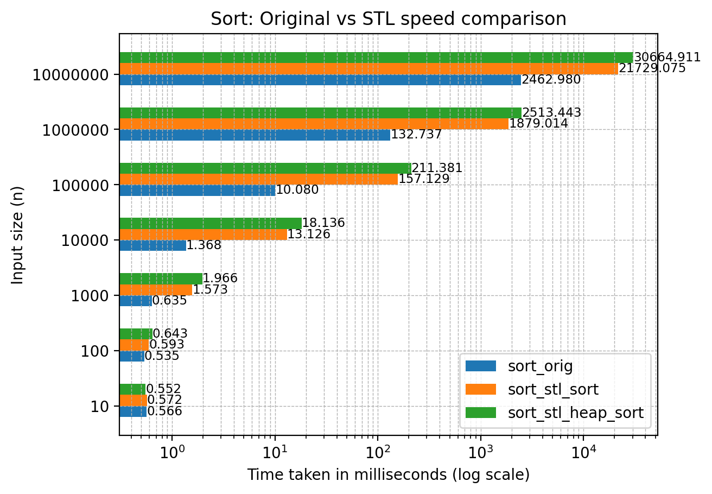

This project was implemented as part of Assignment 1 of Advanced Data Structures and Algorithms (CS5800), 2024 at Indian Institute of Technology, Madras.

# Requirements

The C++ source requires g++, clang or an equivalent compiler and is platform independent. Other (Python) tools and scripts are potentially platform dependent. This project has been developed and tested on GNU Linux (5.15.133.1-microsoft-standard-WSL2) and the rest of this document assumes it is being run on a modern Linux distribution.

`cmake` is required to run `make` and the Python requirements have been listed in `requirements.txt`. `valgrind` is required to run memory benchmarking.

# Quick Start

Run `make orig` to generate the binaries in `./bin/`, specifically `pq_orig` and `sort_orig`.

`pq_orig` demonstrates a usage of the class PriorityQueue and its functionalities such as PriorityQueue::insert(), PriorityQueue::remove() and PriorityQueue::peek(), while `sort_orig` demonstrates PriorityQueue::sort(), an implementation of heap sort, as per the [problem statements](#problem-statements) given below.

If you want to use priority_queue as a library, skip to [Usage](#usage).

# Problem Statements

The following problem statements have been used to demonstrate this project's implementation of priority queue and heap sort.

## Priority Queue

### Statement

You are given an array of integers and a series of queries. Implement a priority queue data structure using a binary heap to efficiently manage these integers based on their values. The priority queue should support the following operations:

1. **Initialization**: Initialize the priority queue with an array of integers.

2. **Insertion** (Enqueue): Add an integer priority to the priority queue.

3. **Removal** (Dequeue): Remove and return the priority with the highest value (i.e., the maximum priority) from the priority queue.

4. **Peek**: Return the priority with the highest value without removing it from the priority queue.

### Input Format

The first line of input contains two space-separated integers **n** and **q**, where **n** represents the number of initial elements in the priority queue, and **q** represents the number of queries.

The next (second) line contains n space-separated integers **A[i]**, the initial elements in the priority queue.

The following **q** lines each contain a query. A query can be of the following forms:

- **i x**: insert the integer **x** into the priority queue.
- **r**: remove the top-most element from the priority queue.
- **p**: peek (or print) the top-most element in the priority queue.

### Output Format

For every peek/print query, print a single integer on a new line: the top-most element of the priority queue.

### Constraints

0 ≤ **n, q** ≤ 10⁷

-10⁹ ≤ **A[i], x** ≤ 10⁹

## Sort

### Statement

You are given an array of integers. Sort them in place.

### Input Format

The first line of input contains one integer **n**, the number of elements in the array.

The second line of input contains n space-separated integers **A[i]**, the elements of the array.

### Output Format

On a single line, print **n** space-separated integers: the elements of the given array, in sorted order.

### Constraints

0 ≤ **n** ≤ 10⁷

-10⁹ ≤ **A[i]** ≤ 10⁹

# Usage

The PriorityQueue class style is in alignment with C++'s STL containers.

```
#include <priority_queue.hpp>

int main()
{
    // empty initialization
    PriorityQueue<int> pq0;

    // C-style initialization (for arrays)
    int a[] = {1, 2, 3, 1, 4, 7};
    PriorityQueue<int> pq1(a, sizeof(a) / sizeof(a[0]));

    // C++-style initialization (for STL containers)
    std::vector<int> v = {5, 1, 4, 1, 7, 7, 9};
    PriorityQueue<int> pq2(v.begin(), v.end());

    pq2.insert(-5);     // insert -5 into the pq

    int x = pq.peek();  // get the top-most element

    pq.remove();        // remove the top-most element

    int b[] = {6, 4, 3, 2, 14, 18};

    sort(b, sizeof(b) / sizeof(b[0]));

    /* The array b is now sorted. */
}
```

# Performance

## Correctness

The implementations of priority queue and sort have been stress tested against their STL counterparts. Run `scripts/stress_pq.py` and `scripts/stress_sort.py` to verify the same.

## Speed

These implementations of priority queue and sort significantly outperform STL, as can be seen from the below charts:




## Memory

The memory used is on par with STL, as can be seen from the below charts:


Note: these tests/benchmark use a custom input/output library for better performance.
